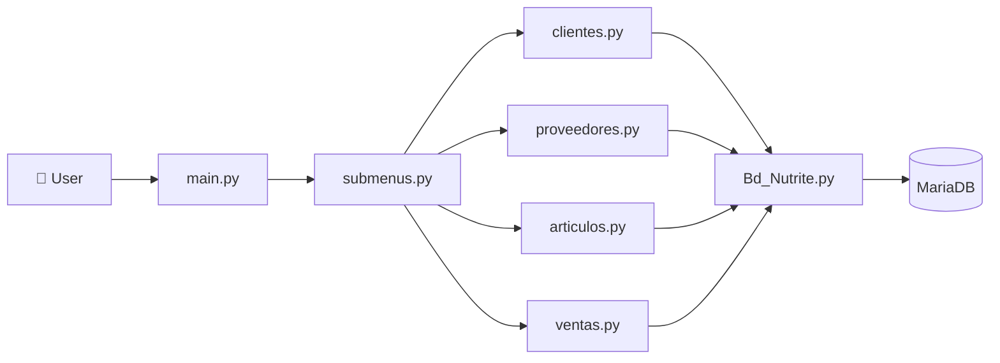
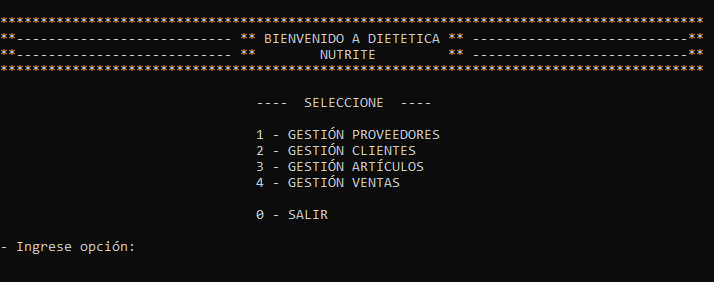
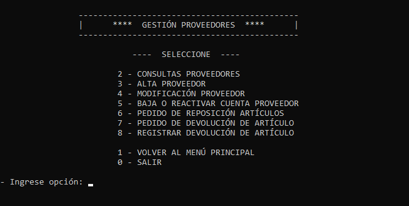
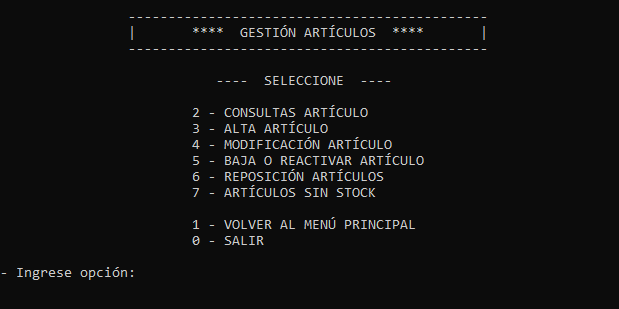
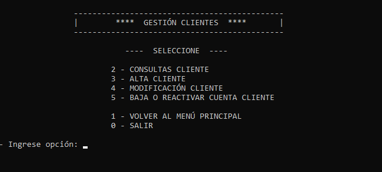
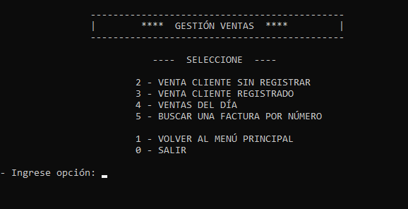
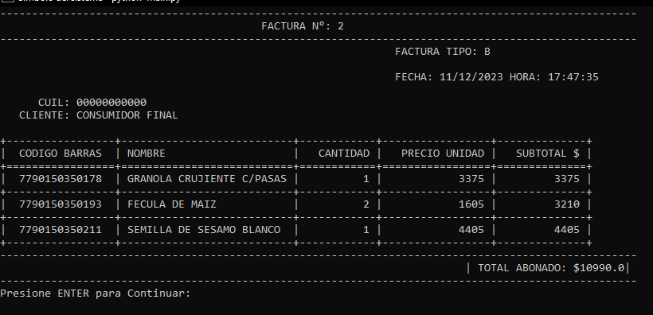

**Read this in other languages:** [Español](README.es.md)


> 💡 **Note**
>
> The application automatically creates the database, tables and initial records on first execution, making the setup process much simpler.

# 🥗 Nutrite - Dietetic Management System (Backend)

## 💼 About This Project

Nutrite is a backend application developed in Python as part of my backend engineering learning journey.

The goal of this project was to design a modular management system capable of handling the daily operations of a dietetic store through a clean object-oriented architecture connected to a relational database.

During its development I focused on applying software engineering principles, database design, code modularization, and CRUD operations while keeping the project scalable and easy to maintain.

Although this project was built as a console application, it represents one of the foundations of my backend development experience.

---

# 📌 Overview

Nutrite is a modular management system that allows administrators to manage the main business entities of a dietetic store.

The application is divided into independent modules, each responsible for a specific business area, making the code easier to understand and extend.

---
## 🏗️ Backend Architecture


---

# 💡 Business Context

## Problem

Small businesses often manage customers, suppliers, inventory and sales manually, making information difficult to organize and maintain.

## Solution

Nutrite centralizes business operations by providing:

- Customer management
- Supplier management
- Product management
- Sales management
- Purchase orders
- Input validation
- Automatic database creation

---

# ⚙️ Features

✔ Customer Management

- Create customers
- Edit customer information
- Delete customers
- Search customers

---

✔ Supplier Management

- Register suppliers
- Update supplier information
- Delete suppliers
- Search suppliers

---

✔ Product Management

- Register products
- Update stock
- Edit products
- Delete products

---

✔ Sales Module

- Register sales
- Calculate totals
- Manage products sold

---

✔ Database

The application automatically creates:

- Database
- Tables
- Relationships
- Initial records

No manual SQL setup is required.

---

# 🏗️ Project Structure

```
main.py
│
├── submenus.py
│
├── clientes.py
├── proveedores.py
├── articulos.py
├── ventas.py
├── pedidoDevo.py
│
├── validaciones.py
│
└── Bd_Nutrite.py
```

Each module has a single responsibility, following a modular backend architecture.

---

# 🧰 Technologies

- Python
- MariaDB / MySQL
- SQL
- Object-Oriented Programming
- Modular Architecture

---

# 🧠 What I Learned

During this project I strengthened my knowledge of:

- Backend application architecture
- CRUD development
- Database normalization
- SQL
- Object-Oriented Programming
- Input validation
- Separation of responsibilities
- Modular software design

This project laid the foundation for my later work with FastAPI, PostgreSQL, Docker and AI-powered applications.

---


## 📸 Screenshots

### Main Menu



---

### Supplier Managemente



---

### Items Management



---

### Client Management



---

### Sales Management



---

### Invoice Generation



---

# 🚀 Installation

## 1. Clone the repository

```bash
git clone https://github.com/StefiVergini/python-dietetic-management-system.git
cd python-dietetic-management-system
```

## 2. Install dependencies

```bash
pip install -r requirements.txt
```

## 3. Configure MariaDB / MySQL

Create a local MariaDB (or MySQL) server.

Update the connection credentials inside:

```
Bd_Nutrite.py
```

Example:

```python
host="localhost"
user="root"
password="your_password"
```

## 4. Run the application

```bash
python main.py
```

At the first execution, the application automatically creates:

- Database
- Tables
- Relationships
- Initial records

# 👩‍💻 Author

**Stefanía Vergini**

Backend Developer • Data & AI Engineering

GitHub:
https://github.com/StefiVergini

# 📄 License

This project is intended for educational and portfolio purposes.
